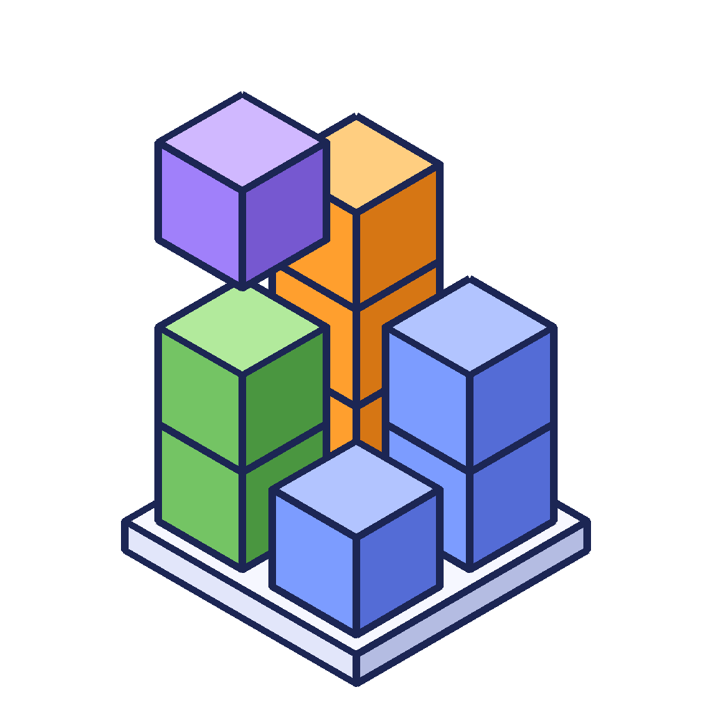

<p align="center"></p>

# Operant 2

Run crews of coding agents from one dashboard.

A **crew** is a team working in one project folder. Its **operators** (Claude Code, Codex or shell sessions) are grouped into **squads**, and each has a stable address like `lead@shop`. Operant 2 starts and stops them, shows their live status, context use, tasks and spend, and gives every Claude Code operator the same `operant` skill, so the whole crew follows one set of rules.

## Features

- Live dashboard of every crew, squad and operator, with a terminal for each operator
- Activity feed, task board, and per-operator spend estimated from Claude Code transcripts
- A daily budget with a warning when it's reached
- CodeGraph indexing of a crew's project, used by operators before they search files
- Settings for models, shell, updates and keyboard shortcuts, applied live
- Automatic updates from GitHub releases on Windows, macOS and Linux

## Install

Download the installer for your system from [Releases](https://github.com/doolecg/operant2/releases): `.msi` for Windows, `.dmg` for macOS (Apple silicon or Intel), `.AppImage` or `.deb` for Linux. Operant 2 keeps itself up to date after that.

Operators need their agent's CLI on your `PATH`: [Claude Code](https://code.claude.com) (`claude`) or Codex (`codex`).

## Development

Requires Node.js 24.

```bash
npm install
npm run dev          # run the app with the Vite dev server
npm test             # unit tests
npm run test:e2e     # build first; drives the app with a fake claude on PATH
npm run dist         # build installers for this system into dist/
```

## Credits

Operant 2's design was inspired by these open-source projects:

- [OpenRig](https://github.com/mvschwarz/openrig) by mvschwarz: running a team of coding agents as one organised, persistent system, with one skill guiding every agent.
- [Paperclip](https://github.com/paperclipai/paperclip) by paperclipai: managing agents with tasks, budgets and a dashboard.
- [CodeGraph](https://github.com/colbymchenry/codegraph) by colbymchenry: the code knowledge graph Operant 2 embeds for indexing.
- [shadcn/ui](https://github.com/shadcn-ui/ui): the UI components.

## License

[MIT](LICENSE) © doolecg
